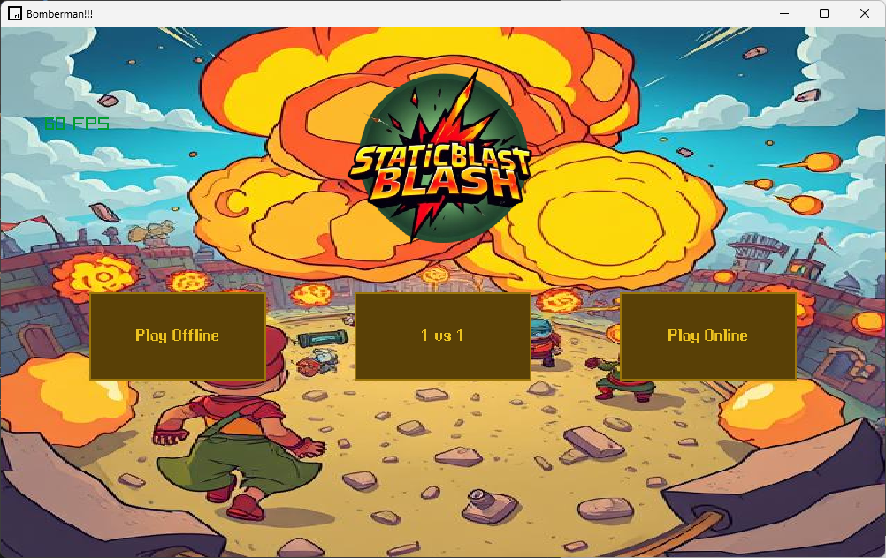
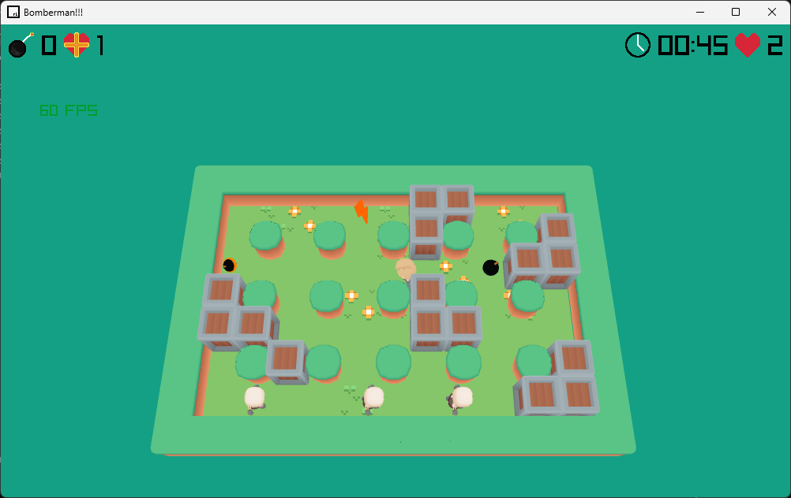
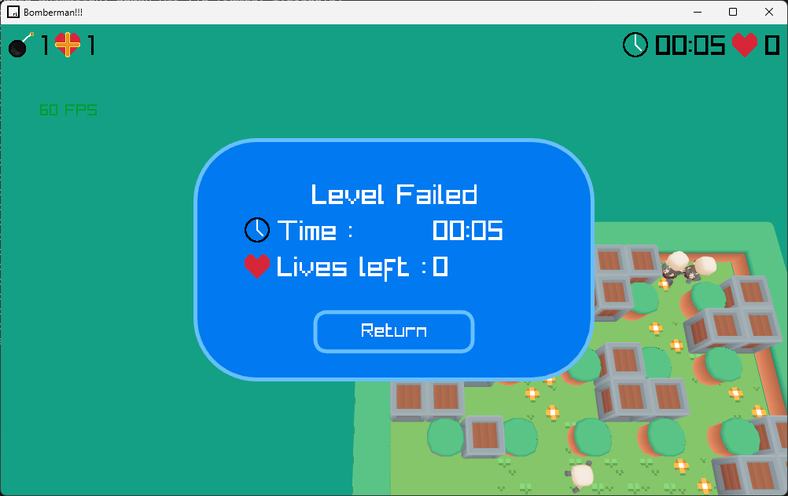

<h1 align="center">Retro Bomberman 3D</h1>

<p align="center">
  
  
  
  
</p>

<div align="center" style="margin: 30px 0;">
    
</div>


## About The Project

**Retro Bomberman 3D** is a modern 3D action arcade game built in C++ using **Raylib** and **Raygui**. It features animated 3D character models, procedural level generation, dynamic powerup systems, handcrafted campaign levels, and a full **3D 1vs1 local multiplayer mode**.

<h2>Project Overview</h2>

<p>
This project was designed and developed as a full-featured Bomberman-style game,
supporting both classic gameplay mechanics and modern rendering techniques.
The focus was on engine modularity, deterministic procedural generation, and
real-time gameplay systems.
</p>

<h2>Key Features</h2>

- **3D 1vs1 Local Multiplayer**: Play head-to-head on the same keyboard with custom split controls and overhead 3D cameras.
- **Single-Player Campaign**: 5 handcrafted balanced levels plus a infinite **Random Procedural Map Generator**.
- **Dynamic Powerup System**: Collect Speed Boosts, Bomb Count Upgrades, and Bomb Explosion Radius Extensions.
- **Animated 3D Characters & Enemies**: Smooth skeletal animations for walking, running, idle, and combat.
- **Responsive UI & Glassmorphism Aesthetics**: Polished main menu, level selector, and level results window.

## Controls
| Action | Player 1 (WASD) | Player 2 (1vs1 Mode) |
| :--- | :--- | :--- |
| **Move Up / Down** | `W` / `S` | `Up Arrow` / `Down Arrow` |
| **Move Left / Right** | `A` / `D` | `Left Arrow` / `Right Arrow` |
| **Drop Bomb** | `Space` | `Right Ctrl` |
| **Pause / Exit Menu** | `ESC` | `ESC` |
---

## Built with

- **C++14** – Game Logic & Physics Core
- **Raylib 5.5** – 3D Graphics Rendering, Animations & Audio
- **Raygui** – User Interface & Menus
- **MinGW-w64 / g++** – Compiler Suite

<h2>Technical Highlights</h2>

<ul>
    <li>Implemented procedural level-generation algorithms to produce random yet
        playable maps</li>
    <li>Engineered a modular game engine core handling:
        <ul>
            <li>Bomb timers and explosion propagation</li>
            <li>Collision detection and player-environment interaction</li>
            <li>Synchronized game-state updates</li>
        </ul>
    </li>
    <li>Designed rendering logic to integrate animated 3D models with gameplay systems</li>
</ul>

## Quick Start & Building
### Prerequisites
Ensure you have **g++** and **Raylib** installed.
### Build & Run with PowerShell Helper
```powershell
# Build and immediately run the game in Release mode
.\make.ps1 play

# Rebuild from scratch
.\make.ps1 rebuild
```

### Build with MinGW Make
```bash
make game
./game.exe
```

<h2>Gameplay Screenshots</h2>
<div style="margin: 30px 0; text-align: center;">
    
    <div style="margin-top: 8px; font-size: 0.9em; color: #555;">
        In-game screenshot showing active gameplay during a procedurally generated level.
    </div>
</div>

<div style="margin: 30px 0; text-align: center;">
    
    <div style="margin-top: 8px; font-size: 0.9em; color: #555;">
        Death menu displayed after player elimination, featuring animated UI elements.
    </div>
</div>

<h2>Attribution & Credits</h2>

<p>
The following third-party resources were used for 3D models and animations in this project.
All assets are used in accordance with their respective licenses:
</p>

<ul>
    <li>
        <strong>Kay Lousberg</strong> –
        <a href="https://kaylousberg.itch.io/" target="_blank" rel="noopener noreferrer">
            https://kaylousberg.itch.io/
        </a>
    </li>
    <li>
        <strong>Kenney Assets</strong> –
        <a href="https://kenney.nl/" target="_blank" rel="noopener noreferrer">
            https://kenney.nl/
        </a>
    </li>
    <li>
        <strong>Poly Pizza</strong> –
        <a href="https://poly.pizza/" target="_blank" rel="noopener noreferrer">
            https://poly.pizza/
        </a>
    </li>
</ul>

<p>
All trademarks and assets remain the property of their respective owners.
</p>
